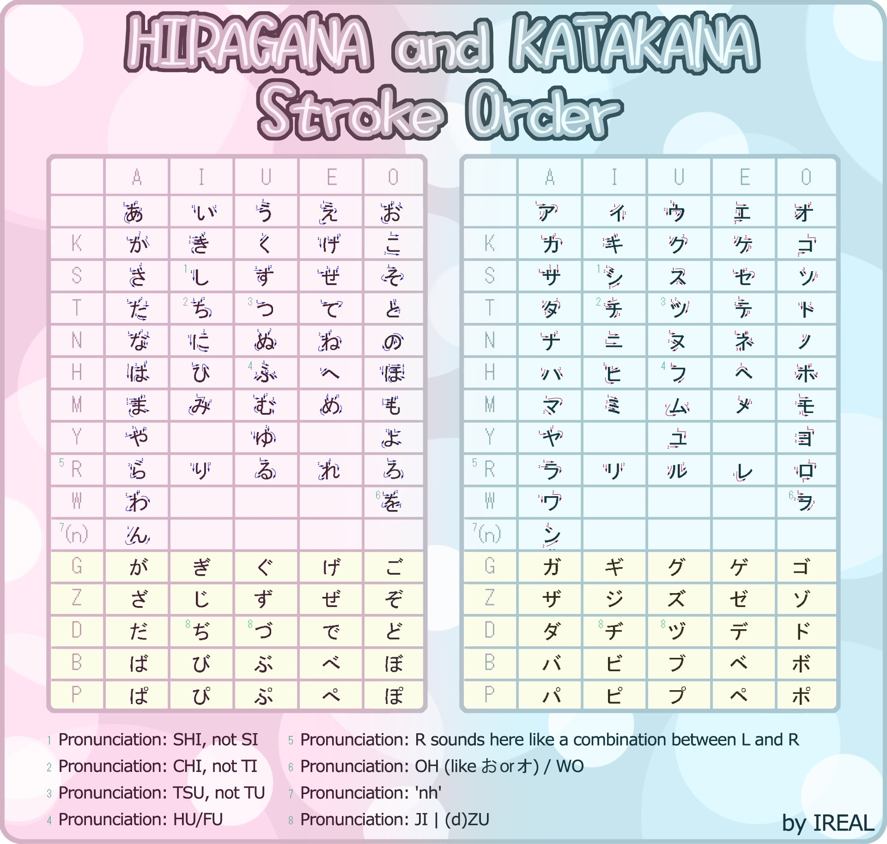
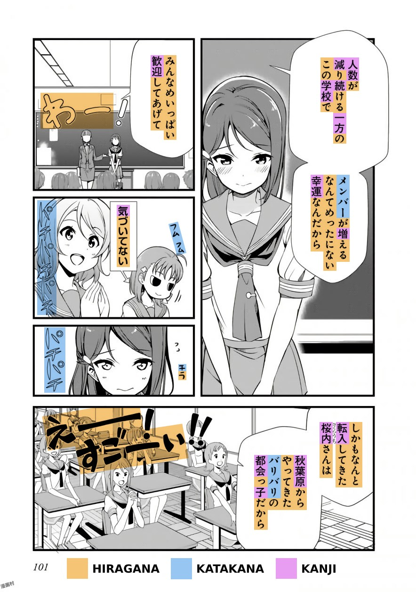

# Leitfaden für Japanisch
Ich bin mir bewusst, dass der folgender Leitfaden sehr lang ist. Aber Sprachenlernen ist etwas Langfristiges, also nehmen du sich bitte die Zeit, diesen Leitfaden vollständig zu lesen.

## Wieso viele Menschen "scheitern" Japansich zu lernen
Bevor ich darauf eingehe, möchte ich erstmal klarstellen, was ich mit "scheitern" verstehe. Was ich meine, ist nicht, seine Ziele nicht erreichen zu können. Viele Menschen lieben die Vorstellung, fließend in einer Sprache zu sein und japanische Unterhaltungsmedien ohne Untertitel in ihrer rohen Form zu schauen. Jedoch, erreichen viele Menschen dieses Ziel nicht, oder kommen ihm nicht einmal nahe dazu. Ich glaube es ist zum Großteil nicht *ihre* Schuld, sondern eher, die Schuld der *Methode*.

Ob du ein *visueller Lerner* oder ein *auditiver Lerner* sind, macht kein Unterschied, wenn es darauf ankommt eine Sprache zu lernen, Ssie haben ein großes Problem, falls du Ihre erste Sprache durch das Hören erlernt haben(wie wir es alle gemacht haben) aber anscheinend sind du eher ein "visueller Lerner”. Zum Großteil kommt es auf die *Methode* an, mit der man japanisch lernt. Es gibt auch andere Faktoren, wie Motivation, oder täglich investiere Stunden/Konsistenz. Aber ich glaube, dass die *Methode* an erster Stelle sehr wichtig ist.

Zum Beispiel, wenn jemand Ihnen mitteilt, du könnten schwimmen lernen, indem du ein Buch über das Schwimmen lesent, würden du dann schwimmen können, nachdem Sie das Buch zu Ende gelessen haben? Nein. Das liegt daran, weil die Methode grunsätzlich fehlerhaft ist - sie funktioniert nicht.

Worauf dieser Leitfaden abzielt ist, Ihnen effektive Methoden zum Erlernen der japanischen Sprache zu vermittlen, damit Sie nicht wie die anderen, die gescheitert sind, enden und stattdessen Erfolg haben, alles während Sie Spaß in Ihrer Zielsprache haben, und in diesem Fall, ist Ihre Zielsprache höchstwahrscheinlich Japanisch.
Zurürck zu den "visuellen Lernern" und "auditiven Lernern" Sache, das mag zwar für andere Lernbereiche zutreffen, gilt aber nicht für das Erlernen einer Sprache. Wir alle erlenen Sprachen auf genau dieselbe Weise, nämlich durch *verständlichen Input*. Ich treffe oft Leute an, die sagen: “Jeder lernt anders” und das mag für andere Lernbereiche zutreffen, aber nicht für  die Aneignung von Sprachen.
Stichwort: *Aneignung*.

### Lernen vs. Aneignung
Das anständige *lernen* einer Sprache bezieht sich auf den bewussten Prozess, ähnliche zu dem was man in der Schuler erlebt. Dem Individiuum werden “Grammatikregeln” und/oder eine “Vokabelliste” zum Auswendig lernen gegeben. Wenn es dann darauf ankommt in der Sprache zu kommunizieren, versuchen der Einzelne sich an diese Grammatikregeln und Vokabeln, die *gelernt* wurden, zu erinnern und versucht dies zu benutzen um zu sprechen. Laut Stephen Krashen, dem führenden Linguisten auf dem Gebiet der Aneignung von Sprachen, ist dies weniger effektiv als *Aneignung*.

Die Aneignung von Sprache ist ein natürlicher, intuitiver, und ein unbewusster Prozess, dessen sich der EInzelne nicht bewusst sein muss.

Was es eigentlich bedeutet ist, dass dieser Prozess fundamental der gleiche für jeden ist, daher *natürlich* und angeeignete Stücke der Sprache können *intuitiv* genutzt werden, wobei der Einzelne, im Gegensatz zum Lernen, keine Zeit zum Nachdenken zum Bilden von Sätzen unter Verwendung von *gelernten* Grammatikregeln und Vokabllisten benötigt. Und schließlich, bedeutet unbewusst, dass der Einzelne sich nicht bewusst ist, dass der Prozess stattfindet; der Aneingnungsprozess fühlt sich vielleicht nicht wie "Sprachenlernen" an, und wenn neues Wissen angeeignet wurde, hat der Erbwerber nicht das Gefühl, etwas gelernt zu haben.

Aneignung benötigt *bedeutungsvolle* Interaktion mit der Zielsprache, bei der sich der Lerner auf die *Beduetung* fokussiert, anstatt ihrer Form. Was das bedeutet ist, dass Jemand nicht auf die *Form* der Sprache die gehört wird und/oder seinen Äußerungen konzentriert, sonder auf die Nachricht, die vermittelt und verstanden wird.

***※ “Japanisch lernen” kann sich unsachgemäß zur Aneignung und Lernen beziehen. Also behalte das bitte im Kopf.***

### i+1

Von Wikipedia: “[Die Input-Hypothese] besagt, dass Lernende in ihren Sprachkenntnissen Fortschritte machen, wenn sie Sprachinput verstehen der etwas weiter fortgeschritten ist als ihr derzeitiges Niveau. Krashen nannte diese Stufe des Inputs “i+1”, wobei “i” für die Interimsprache des Lernenden und “+1″ für die nächste Stufe des Spracherwerbs steht."

Vereinfacht ausgedrückt bedeutet i+1 “eine [und nicht mehr als eine] Sache [Teil der Sprache] die Sie in dem Satz noch nicht kennen.
Angenommen, Sie lernen Englisch und hören den Satz "I'm playing the guitar", aber kennen nur das Wort "playing" nicht. Dieser Satz wäre i+1, weil Sie alle Wörter und grammatikalischen Strukturen außer dem Wort "playing" kennen. Es ist auch ein verständlicher Input, WENN Sie die Botschaft, die vermittelt wird, verstanden haben.

i+1 ist wichtig, weil auf dieser Ebene die höchsten Erwerbsgewinne erzielt werden.

### Input & verständlicher Input
*Input* selbst bezieht sich auf das Hören und Lesen von einheimischen Medien in Ihrer Zielsprache. *Massen Input* kann sich auf *immersion* beziehen. Einheimische Medien sind Inhalte, die von Einheimischen für Einheimische gemacht wurden. (Rohe) Anime wird von Einheimische und für Einheimische gemacht, daher sind sie einheimische Medien.
*Verständlicher Input* bezieht sich auf den Input, bei dem die Botschaften vermittelt und verstanden werden. Es ist der wichtigste Bestandteil der Aneignung von Sprache. Ein beliebiger Input ist für die Aneignung nicht ausreichen, der Input muss *verständlich* sein.

Als ANfänger mag es jedoch schwierig erscheine, verständlichen Input zu finden, und das stimmt auch. Ich werde später darauf eingehen, wie Sie auch von *unverständlichem Input* profitieren können, aber nicht auf dieselbe Weise. Sprache wird nicht durch unverständlichen Input angeeignet, sondern durch verständlichen Input. Behalten Sie das also bitte im Hinterkopf.

Es ist auch wichtig, sich vor Augen zu halten, dass Sprechen (Output) nicht gleichbedeutend mit dem Üben einer Sprache ist. Wenn Menschen Anekdoten darüber erzählen, wie sie in einer Sprache besser geworden sind, indem sie viel gesprochen haben, ist ihnen nicht bewusst, dass es der Input (des Partner) war, der ihre Sprachkenntinisse verbessert hat.

Das Sprechen (Output) ist nur das Sahnehäupchen, wobei die eigentliche Aneignung von Sprache der Input ist.

### Wissen, wessen Rat man vertrauen kann
Es mag natürlich erscheinen, so viele Ratschläge anderer Leute anzunehmen wie möglich, schließlich haben sie ja Erfahrung oder? Vielleicht können Sie etwas wertvolles lernen? Nun, nicht ganz.
Wenn die Person, deren Rat Sie annehmen, nicht das erreicht hat, was Sie erreichen wollen, dann haben Sie keinen Grund, ihrem Rat zu vertrauen. Jedoch wenn Sie es tuen, dann werden Sie nicht besser als das niedrige Level auf dem sich gerade diese Person befindet.

Als Anfänger haben Sie keine Möglichkeit, die Sprachkenntnisse eines anderen richtig einzuschätzen, da Ihre Sprachkenntnisse sehr gering oder praktisch nicht vorhanden sind, so dass Sie nicht beurteilen können, ob Ihr Freund wirklich gut Japanisch beherrscht oder nicht.

Warum ist das wichtig? Weil ich oft auf Leute treffe, die sagen: "Aber mein Freund, der Japanisch lernt, hat mir gesagt, dass...", und das, was der Freund dem anderen Freund erzählt hat, ist normalerweise ziemlich falsch und offensichtlich falsch.

Hat Ihr Freund etwas erreicht, das dem entspricht, was Sie erreichen wollen? Wenn nicht, werden Sie nicht viel Glück haben, über das niedrige Niveau hinauszukommen, auf dem diese Person sich befindet, wenn Sie ihren Ratschlägen folgen. Das wäre so, als würden Sie Diät-Ratschläge von jemandem annehmen, der fett ist.

## Effektiv Japanisch "lernen"
Nachdem Sie nun die Grundlagen der Anneignung von Sprache kennen, wollen wir uns damit beschäftigen, wie Sie Japanisch lernen können.
### Kana

Kana bezieht sich auf *hiragana* und *katakana*, sie beide sin die Schriftzeichen der japanischen Sprache. Hiragana und Katakana sind zwei Versionen der gleichen Laute in der Sprache.

Hiragana wird für Wörter und Namen verwendet, die nicht in Kanji geschrieben werden, sowie für grammatikalische Zwecke. Der/die Schreiber/in kann wählen, ob er/sie die Kanji-Form verwenden möchte oder nicht.
Katakana wird für Wörter, die aus anderen Sprachen entlehnt wurden, und für fremde Namen verwendet; es kann auch zur Betonung eingesetzt werden, jedoch ist die Verwendung von Hiragana und Katakana nicht immer einheitlich, was Sie bitte beachten sollten.
Das Kana ist nicht schwer zu meistern, deshalb würde ich sagen, lerne es, wie du willst. Es ist besser, wenn du es auch mit Ton lernst.
Mnemotechniken scheinen eine gute Idee zu sein, aber ich habe Leute gesehen, die sich darüber beschwert haben, dass es den Prozess des Erinnerns an das Kana langsamer macht, also würde ich sagen, einfach mit roher Gewalt.

***Das müssen Sie zuerst lernen.***

Ich empfehle Ihnen, [Tae Kim](https://itazuraneko.neocities.org/grammar/taekim.html) zu lesen und nach *Das Schriftsystem* eine Pause einzulegen. Dies dient dazu, etwaige Missverständnisse über Kana auszuräumen, damit Sie aus erster Hand genau wissen, was sie sind und wie sie verwendet werden.

Danach sollten Sie die folgende Tabelle in ein Notizbuch oder etwas Ähnliches abschreiben. Danach brauchen Sie vielleicht nie wieder einen Stift zu benutzen :smile:

Die Tabelle:

*Klicken Sie hier, um das Bild zu vergrößern*

Wenn Sie das getan haben, sollten Sie auf [DJT Kana](https://djtguide.neocities.org/kana/index.html) gehen und alle Kana überprüfen, indem Sie auf "anzeigen/ausblenden" geen und sich selber testen. Vergewissern Sie sich, dass Sie auch nach unten scrollen und alle Hiragana- und Katakana/Katakana-Kombinationen untersuchen!

Schritte, wenn Sie verwirrt sind:
> 1. Lesen Sie [Tae Kim](https://itazuraneko.neocities.org/grammar/taekim.html) bis Sie *Das Schreibsystem* abgeschlossen haben.
> 2.  Schreibe die obige Tabelle in ein Notizbuch oder etwas Ähnliches ab.
> 3. Testen Sie sich selbst, indem Sie [DJT Kana](https://djtguide.neocities.org/kana/index.html) benutzen. Überprüfen Sie alle Kana, indem Sie auf "Anzeigen/Ausblenden" gehen und sich selbst testen. ACHTEN SIE DARAUF, dass Sie auch nach unten scrollen und alle Hiragana- und Katakana/Katakana-Kombinationen überprüfen!

Nach etwa einer Woche sollten Sie alle Kana auswendig gelernt haben.

### Kanji

<figure>
  
  <figcaption>Kanji, die japanischen Erstklässlern beigebracht werden.</figcaption>
</figure>

Kanji, was wortwörtlich "chinesische Schriftzeichen" bedeutet, ist der dritte Teil es japanischen Schriftsystems. Sie sind logografisch und daher viel komplexer als Kana. Es gibt 2136 Kanji, die im japanischen Schulsystem gelehrt werden, aber lassen Sie sich davon nicht täuschen.

Etwa 3000 oder mehr werden im täglichen Leben verwendet. Kanji werden verwendet, wenn sie gebraucht werden. Sie werden irgendwann verstehen, was das bedeutet, wenn Sie ein wenig fortgeschrittener in Japanisch geworden sind

<!-- https://media.discordapp.net/attachments/732715294459691044/733033853127622696/02.jpg?width=471&height=670 -->

*Oben ist eine Seite aus dem Manga Love Live! Sunshine!! Manga, die Hiragana, Katakana und Kanji zeigt.*

**Annäherung an Kanji - Kanji mit Vokabeln vs. isoliertes Kanji-Lernen**

Es gibt zwei Möglichkeiten, an Kanji heranzugehen. Die eine ist **Kanji mit Vokabeln**, d.h. man lernt Wörter vom Lesen her, ohne die einzelnen Kanji zu lernen. Man kann "守銭奴" vollständig verstehen, ohne zu wissen, was die einzelnen Kanji bedeuten, indem man sie einfach in einem Wörterbuch nachschlägt.

Die andere ist das **isolierte Kanji-Studium**, bei dem die Bedeutung und Zusammensetzung der einzelnen Kanji untersucht wird. Beispiel: "守"(Wächter)"銭"(Münze)"奴"(Typ) = Geizhals. Hm? It’s pretty smart. Das ist ziemlich schlau. Isoliertes Kanji-Lernen kann das Erinnern von Vokabeln erleichtern, aber es kann Sie aufgrund des hohen Zeitaufwands zurückwerfen, so dass es an Ihnen liegt zu entscheiden, ob es sich lohnt.

※ Eine weitere interessante Sache über Kanji mit Vokabeln ist, dass wenn Sie andere Wörter kennen, die ebenfalls das Kanji des betreffenden Wortes verwenden, können Sie es sich leichter merken. (Beispiel: Wenn Sie "**守**護", "**銭**湯" und "売国**奴**" verstehene, dann wird "**守銭奴**" einfacher fallen zu lernen)

**Anleitung: Kanji mit Vokabeln**

Dies ist die einfachste Methode, um Kanji zu lernen, und es ist die Methode, die ich persönlich gewählt habe. Die meisten Menschen sind in der Lage, Kana zu lesen, indem sie sich auf die Kana-Tabelle beziehen, aber für Kanji kann man das nicht tun. Wie lernt man also, Kanji zu lesen?

Schauen Sie sich das Manga-Bild oben an. Schauen Sie auf das erste Feld. Sehen Sie "人数"? Das ist ein Wort. Schlage es in einem Wörterbuch nach, z. B. in [Jisho](https://jisho.org). Sie bekommen die Leseweise: "にんずう (ninzuu)" und die Bedeutung: "Anzahl der Menschen". Cool, mach weiter. Das war's. Erwarten Sie aber nicht, dass Sie sich Wörter nur durch einmaliges Nachschlagen merken können, deshalb sollten Sie viel lesen, um Kanji-Fähigkeiten aufzubauen und zu behalten. Am Ende des Leitfadens werde ich Ihnen zeigen, wie Sie sich das Nachschlagen von Wörtern erleichtern können.

**Anleitung: Isoliertes Kanji-Lernen**

Wenn man sich als Anfänger den Kanji nähert, können sie eher wie Kritzeleien als wie vertraute Formen aussehen. Kanji haben gemeinsame Formen und Muster und Isoliertes Kanji-Lernen hilft Ihnen, diese gemeinsamen Formen und Muster zu sehen. Anstatt dass "草" wie eine zufällige Zeichnung aussieht, können Sie sehen, dass es aus "艹", "日" und "十" zusammengesetzt ist.

Eine isolierte Kanji-Lernmethode, die ich empfehle, ist **Kodansha kanji learner's course (KKLC)**, Sie können das Buch [hier](https://mega.nz/#!ncYFXTyJ!KXwmhJu4QogtPasf0wt_zxyGvIfnm4gXxKsmdIv51sQ) bekommen und eine Lernanleitung [hier](https://keystojapanese.com/how-to-study/). Lernen Sie nicht die Vokablen im Buch! Lernen Sie nur die Vokabeln, die in den Abschnitten [Vokablen](#vocabulary) und [Mining](#mining) beschreiben sind.

In diesem Sinne, durch stundenlanges Lesen und Nachschlagen von Wörtern werden Sie lernen, Kanji intuitiv zu erkennen, jedoch haben viele Menschen Schwierigkeiten, japanische Kanji zu lesen, ohne sie vorher gelernt zu haben, und ein isoliertes Kanji-Studium könnte Ihnen in diesem Fall helfen, denn es gibt Ihnen einen Hinweis darauf, was das Kanji bedeutet, bevor Sie es lesen. Isoliertes Kanji-Lernen ist jedoch ein erheblicher Zeitaufwand, der nicht dazu beiträgt, Japanisch auf sinnvolle Weise zu lernen und um wirklich "Kanji zu lernen", müssen Sie sowieso Kanji mit Vokabeln lernen. Sie sollten selbst entscheiden, ob Sie isoliertes Kanji-Lernen betreiben wollen oder nicht.

### Vokabeln

Der größte Teil Ihrer Sprachreise besteht aus dem Lernen von Vokabeln, Sie werden also eine Menge davon machen müssen.

Anki ist ein digitales Karteikartenprogramm mit einem "spaced repetition" System, einer Technik aus der Kognitionswissenschaft für schnelles und dauerhaftes Einprägen von Information. Es soll Ihnen helfen, sich Informationen zu merken. Sie können es [hier](https://apps.ankiweb.net/) erhalten.

Sie sollten Anki verwenden, um einen Grundwortschatz aufzubauen, der Ihnen beim Eintauchen in die Sprache hilft. Danach wird das Lernen von Vokabeln durch Eintauchen in die Sprache, insbesondere beim Lesen, einfacher. Normalerweise benutzen Leute das *Core 2K* Deck, um einen Wortschatz von 2000 Wörtern aufzubauen. Auf der Vorderseite ist das zu lernende Wort abgebildet, auf der Rückseite die Bedeutung und wie es zu lesen ist, zusammen mit einem gesprochenen Beispielsatz. Mit Core2K lernen Sie Wörter, indem Sie sich die Bedeutung und die Leseweise des angezeigten Wortes einprägen. Ich rate jedoch von Core2K ab und schlage stattdessen [*Tango N5+N4*](https://learnjapanese.moe/resources/#vocabulary) vor aus folgenden Gründen:

Core 2K ist wesentlich schwieriger als [Tango N5+N4](https://learnjapanese.moe/resources/#vocabulary) weil bei Tango der Satz auf der Vorderseite steht, bei Core 2K nur das Wort auf der Vorderseite.
Bei den Tango-Decks wird auf der Vorderseite ein Satz angezeigt und auf der Rückseite die Informationen (eine Bedeutung und Leseweise), die zum Verständnis des Satzes erforderlich sind. Sie klicken auf "Gut", wenn Sie den Satz verstanden haben, und auf "Nochmal", wenn Sie ihn nicht verstanden haben.
Die "N"-Zahl im Namen des Kartensatzes bezieht sich auf die Japanisch-Sprachprüfung Japanese Language Proficiency Test (JLPT), wobei N5 die niedrigste und einfachste und N1 die höchste Stufe ist. Sätze erleichtern das Erinnern von Vokabeln, denn sie kommen dem Sprachgebrauch im wirklichen Leben viel näher als einzelne Wörter.

**Es ist jedoch zu beachten, dass die Übersetzungen von Tango nicht wortgetreu sind und die japanische Struktur nicht gut wiedergeben, also ist das wohl ein Fehler von Tango. In anderen Fällen könnte es völlig falsch sein.**

Die Leute haben sich immer mit Core 2K schwer getan, und um den Prozess reibungsloser zu gestalten, empfehle ich [Tango N5+N4](https://learnjapanese.moe/resources/#vocabulary) gegenüber Core 2K. Vor allem, wenn Sie kein isoliertes Kanji-Lernen machen wollen!

Ich empfehle Ihnen, mit dem Vokabellernen mit Anki zu beginnen, nachdem Sie die Kana gelernt haben und die grundlegendsten grammatikalischen Regeln beherrschen.  Wie grundlegend extrem grundlegend ist, liegt an Ihnen zu entscheiden. Ich werde durchgehen, wie man Grammatik lernt nach diesem Abschnitt, also keine Panik.

### Grammatik
Wenn Sie sich der Grammatik nähern, ist es wichtig zu wissen, dass der Zweck eines Grammatikleitfadens nicht darin besteht, Sie zu einem Meister der Sprache zu machen, sondern Ihnen nur ein grundlegendes Verständnis dafür zu vermitteln, wie die Dinge in der Sprache funktionieren, und dass ein wirkliches Verständnis der Grammatik nur durch Vertiefung erreicht werden kann. Therefore, Ich empfehle Ihnen eine Grammatikanleitung zu wählen, es zu lesen/schauen **und** Immersion machen.

**Auswahl einer Grammatikanleitung**

Es gibt viele Grammatikführer, einige sind gut, andere wiederum schlecht. Um Verwirrung unter den Lernenden zu vermeiden, werde ich nur 2 Grammatikanleitungen erwähnen. Tae Kim and Cure Dolly. Tae Kim und Cure Dolly. Kein Grammatikführer ist perfekt, jeder hat seine Höhen und Tiefen. Tae Kim ist ziemlich gut geschrieben und sehr anfängerfreundlich, allerdings sind einige seiner Erklärungen ein wenig abwegig und es kann langweilig werden, sie zu lesen. Cure Dolly verfolgt einen unorthodoxen Ansatz für die japanische Grammatik und versucht, die japanische Grammatik auf eine eher japanische, "organische" Weise zu lehren.

Cure Dolly ist jedoch nicht unbedingt anfängerfreundlich, man braucht zumindest ein *gewisses* Hintergrundwissen, bevor man es benutzt. Außerdem ist der Ton sehr schlecht.
Sie können die 2 Grammatikführer unten finden:

[Tae Kim](https://itazuraneko.neocities.org/grammar/taekim.html)
*Es gibt auch eine Android- und iOS-App für die Offline-Ansicht! Beachten Sie, dass alles in diesem Leitfaden als "Grundkenntnisse der japanischen Sprache" betrachtet wird, auch der Abschnitt "Fortgeschrittene."*
[Cure Dolly](https://www.youtube.com/playlist?list=PLg9uYxuZf8x_A-vcqqyOFZu06WlhnypWj)
*Ich empfehle, die Untertitel einzuschalten und die Geschwindigkeit auf 1,25x einzustellen!*

In diesem Sinne empfehle ich, Grammatik in Verbindung mit Immersion und Vokabel lernen zu lernen

### Mining

Mining bedeutet, dass du Vokabeln (oft zusammen mit dem Satz, in dem sie vorkommen) zu deinem Anki-Deck hinzufügst. Du kannst diese Karteikarten dann immer wieder durchgehen, um sicherzustellen, dass du sie nicht vergisst. In der Regel wird empfohlen, mit dem Mining gleich nach Abschluss von Tango N5+N4 zu beginnen. Du solltest dich nicht mit Tango N3, N2 und/oder N1 beschäftigen, denn zu diesem Zeitpunkt solltest du deine eigenen Karteikarten aus deiner Immersion erstellen, was insgesamt ein unterhaltsamer Prozess ist.

Minning ist etwas, das du für eine lange Zeit machen wirst, also ist das ziemlich wichtig.
Es gibt eine Menge Meinungsverschiedenheiten, wenn es um "Formate" vom Mining geht, aber ich denke, das "Anime cards"-Format ist sehr gut und hat mir wirklich gut gedient.

**Animecards Vokabelnkarten**
Animecards sind *hochwertige* Vokabelkarten, die sich von den Standardvokabelkarten unterscheiden. Standardvokabelkarten haben einfach das Wort in Kanji-Form auf der Vorderseite und die Lesung und Bedeutung dieses Wortes auf der Rückseite. Hochwertige Vokabelkarten haben im Gegensatz zu Standard-Vokabelkarten den Ton des Satzes (aus einem Anime oder einer vertonten Visual Novel), außerdem ein Bild (aus einem Anime oder einer Visual Novel) und den Satz, aus dem das Wort stammt, auf der Rückseite, wodurch sie den Standardvokabelkarten weit überlegen sind.

Ich denke, dass es gut ist sich von *Satz*-karten wegzubewegen, nachdem man fertig mit Tango N5 und N4 (Tango decks are sentence cards by the way) geworden ist, da die Vokabelkarten leicht und schnell zu lernen sind, wenn man sich mit dem einfachen Japanisch vertraut gemacht hat.

※ Sie sind bekannt als "Anime cards", aufgrund von[AnimeCards Site](https://animecards.site)

__Vorteile__
+ Einfach einzurichten
+ Schnell zu wiederholen. Damit schaffe ich durchschnittlich 500 Karten in 30 Minuten.
+ Kann alles und jenes minen (folgt nicht i+1)
+ Kompensiert Wörter mit mehreren Bedeutungen mit dem Hinweisfeld.

*minen: das Verb von Mining*

Nachdem Sie die Tango N5 und N4 decks durchgenommen haben, sollten Sie diese Seite [AnimeCards Site](https://animecards.site/ankisetup/) lesen, um zu lernen, wie man ein Mining Deck aufbaut.

### Wie man eintaucht (Immersion) (Input erhalten)
Was Sie bei Immersion tun müssen, hängt davon ab, auf welcher Stufe Sie sich befinden. Deshalb ist es schwierig, einen einheitlichen Leitfaden für alle japanisch Lerner zu erstellen. Ich werde nur durchgehen, was Sie als Anfänger tun müssen.

#### Hören

Zunächst einmal, muss man bei Immersion lernen, die Mehrdeutigkeit zu tolerieren. Es geht nicht darum, alles zu verstehen. Es ist nicht ungewöhnlich, dass Lernende sich niedergeschlagen fühlen, weil Sie etwas nicht verstehen, aber ich denke, es ist völlig in Ordnung, wenn man nichts versteht, man sollte sich über jedes Wort freuen, das man erkennt, über jede Kleinigkeit, die man versteht, und nur weil man es jetzt nicht versteht, heißt das nicht, dass man es nicht immer verstehen wird.
Der wichtigste Teil des Japanischlernens ist **sich selbst zu genießen** :slight_smile: .

Wenn Sie Anfänger sind, empfehle ich Ihnen, das Immersion durch Zuhören dem Immersion durch Lesen vorzuziehen. Der Grund dafür ist, dass man, wenn man sich zum ersten Mal einer Fremdsprache nähert, noch nicht an die Phoneme (Laute) der Sprache gewöhnt ist, so dass man beim Lesen einen schlechten Akzent bekommt.  Das ist der Fall, wenn man ähnliche, aber falsche Phoneme aus seiner Muttersprache mit dem Japanischen assoziiert, es ist unmöglich zu lesen, ohne eine phonetische Komponente abzubilden, so dass man dies nur vermeiden kann, indem man sich zuerst an die Phoneme gewöhnt, und das kann man nur durch rohem Hören tun.

Außerdem fließt das Zuhören einfach ohne Unterbrechung, so dass man sich bei Immersion wohler fühlt. Auf der anderen Seite ist Lesen als Anfänger sehr frustrierend, da man ständig Wörter nachschlagen muss, wahrscheinlich jede Sekunde.

Überraschenderweise gibt es viele i+1-Möglichkeiten bei der Immersion durch Zuhören als Anfänger, vor allem, wenn man neben der Immersion auch Grammatik und Vokabeln lernt, so dass es immer noch als verständlicher Input gilt, auch wenn man andere Teile nicht versteht. Aber eine Sprache wird nicht durch unverständlichen Input angeeignet, schon vergessen? Das stimmt, aber Sie profitieren immer noch von unverständlichem Input, aber auf eine andere Art und Weise: Es verbessert Ihre Fähigkeit, Phoneme zu unterscheiden, mit anderen Worten, er verleiht Ihnen einen besseren Akzent. Immersing in der Sprache, auch wenn Sie nicht viel verstehen, ist eine gute Möglichkeit, sich die Interaktion mit der japanischen Sprache zur Gewohnheit zu machen.

Diesbezüglich jedoch, Immersion (input) in diesem Stadium wird noch weitgehend unverständlich sein, aber das können Sie ändern, indem Sie die Tango Anki Decks durcharbeiten.

Bitte beachten Sie, dass Sie auf Ihre Immersion achten müssen. (Aktive Immersion).
Es hilft Ihnen nicht, wenn Sie es einfach im Hintergrund laufen lassen und nicht aufpassen (Passive Immersion).

**Auswählen in was man Immersion machen soll**

Normalerweise ist es am Besten, wenn sie Immersion mit visuellen und auditiven Komponenten betreiben, wie Anime und japanische Dramen (Ferneserien). Ferneserien haben visuelle Komponente, und eine Handlung, welche es zu i+1 Möglichkeiten eröffnet. In der Regel wird dagegen empfohlen Immersion mit einem Podcast als Anfänger zu machen, da es schwierig sein wird zu verstehen was passiert. Wenn Sie japanisch lernen, dann ist die Wahrscheinlichkeit hoch, dass Sie auch ein Fan von Anime sind, also können sie Anime für Immersion benutzten und sogar Anime, die Sie schon gesehen haben.
What is also pretty helpful is reading an episode summary of the episode on Wikipedia before watching it, this can help you understand the plot more, so you can make more acquisition gains.

**Was muss ich "machen" während aktiver Immersion? (Als ein Änfänger)**

Versuchen Sie die Botschaften zu verstehen. There is a lot you can infer from a TV show. Like Krashen says, you need to have “meaningful” (meaning focused) interaction with the language, rather than focusing on form (such as grammar).

#### Das Lesen
Das Lesen, egal auf welchen Level du dich befindest, kann dir sehr nützlich sein. Jedoch, als jemand neues in der Sprache, gibt es einige Problem zu Beginn des Prozesses zum Vorschein kommen.
Frühe lesen anzufangen kann ein schlechter Einfluss auf deinen Akzent haben. Außerdem lässt sich deine Lesestärke nicht immer auf die Hörfähigkeit übertragen (d.h. fähig zu sein, neu gelernte Wörter zu erhören), insbesondere wenn die Hörfähigkeit sehr gering ist.

Wenn du ein Änfänger bist, empfehle ich Anime mit Untertitel anzuschauen. Japanische Untertitel sind bestenfalls eine Lesevertiefung, ähnlich wie bei einer vertonten Visual Novel. Die Stimmen im Hintergrund werden nicht deinen Akzent retten, als auch dein Hörverständnis verbessern, du wirst rohes hören dafür mache müssen. Du kansnt [animecards.site](https://animecards.site/minefromanime/) besuchen, um herauszufinden wie man Anime it japanischen Untertitel anschaut.

[*Eine Visual Novel, oft abgekürzt als VN, ist ein interaktives Videospiel-Genre, das eine textbasierte Geschichte mit literarischem Erzählstil und Interaktivität bietet, unterstützt durch statische oder sprite-basierte Grafiken, meist im Anime-Stil oder gelegentlich auch Live-Action-Standbilder.*]

Jedenfalls halte ich es für gut, beim Lesen mit japanischen Untertiteln zu beginnen. Und dann zu Manga überzugehen, und dann Light Novels/Visual Novels und so weiter. Ich denke, es ist wichtig, dass du dir beim Lesen Zeit lässt, damit du nicht einen Burnout bekommst, wenn du versuchst als Anfänger schwerere Bücher zu lesen; normalerweise ist es besser, Bücher zu lesen, die nicht allzu weit von deinem Niveau entfernt sind.
In unseren [Resources](/resources) findest du Links zu Websites, auf denen du viele japanische Mangas und Romane kostenlos lesen kannst. Und japanische Untertitel gibt es auch, also sieh dir das unbedingt an!

**Die Balance zwischen dem Hören und Lesen finden**

Balance ist wichtig. Es mag naheliegend sein, die Zeit einfach in zwei Hälften zu teilen, und wenn Sie dazu in der Lage sind, dann ist das großartig. Allerdings hat nicht jeder die Zeit dazu, und wenn es um das Lesen geht, kann es je nach Kenntnisstand sehr schwierig sein, stundenlang zu lesen. Menschen, die im Tango Anki Deck schon weiter sind, können zum Beispiel länger lesen als diejenigen, die noch nicht so weit sind.

Was ist also die perfekte Balance?
Das kann ich nicht beantworten, das musst du selbst herausfinden und entscheiden. Es höngt alles von deinem zeitplan und deinem aktuellen Niveau ab. Du musst nicht vom ersten Tag an lesen, gib dir ein paar Wochen Zeit, bis du die Grundwörter aus dem [Tango N5](https://learnjapanese.moe/resources/#vocabulary) Anki-Deck lesen kannst.

## Zusammenfassung

1. Lerne die [kana](#kana) und beginne mit dem Lernen aus dem von dir gewählten Grammtikleitfaden.
2. Lade Anki herunter und richte es ein. Importiere das Tango N5 Deck, indem du es anklickst.
3. Klicke das auf das Zahnradsymbol neben dem Deck > Optionen. Die Anzahl der neuen Karten pro Tag ist standardmäßig auf 20 eingestellt. Versuche, diese Zahl ein paar Tage lang beizubehalten und sieh dann wie es dir geht. Wenn du das Gefühl hast, dass es zu viel ist, dann kannst du das Limit auf 15 oder sogar 10 senken. Klicke auf das "Wiederholungen"-Fenster und stelle die maximale Anzahl der Bewertungen pro Tag auf 9999. Lass dich von dieser Zahl nicht erschrecken. Du wirst warscheinlich nicht über 150 liegen, wenn deine Beibehaltungsrate in Ordnung ist. Wenn du mit den Wiederholungen, die du bekommst, nicht mehr mithalten kannst, ist es nicht schlimm die Anzahl der neuen Karten/Tag zu verringern, anstatt die maximale Anzahl der Widerholungen sinken zu lassen. Der Grund dafür ist, dass das Nicht-Erledigen der fälligen Widerholungen das Syste mder räumlichen Wiederholungen von Anki beeinträchtigt. Anki erfodert Konsistenz auf lange Sicht, um effektiv zu sein, weshalb du vielleicht einen Zeitplan dir erstellen solltest. Persönlich mache ich mein Anki, wenn ich morgens aufwache.
4. Mach Anki täglich, während du auch den Grammatikleitfaden deiner Wahl durchgehst **und** täglich Immersion machst.
5. Wiederhole das, bis du Tango N5 beendet hast, denn danach solltest du mit Tango N4 anfangen. Du solltest dich jetzt beim Lesen wohler fühlen. Ich schlage vor, du fängst an, leichte Mangas zu lesen oder ANime mit japanischen Untertitel zu sehen.
6. Nachdem du Tango N4 beendet hast, kannst du dein Mining-Deck einrichten und anfangen zu schauen, was immer du willst oder was immer du lesen willst und **HABE SPAß!!**

### Schlussbemerkungen
Das war's. Du kannst auf diese Weise fließen Japanisch lernen. Vergiss aber nicht, das Immersion das Wichtigste ist. Anki und Grammatik hilft dir bei Immersion.

Musik ist keine Immersion.
Jedoch, kannst du die Lyrics als Leseübung verwenden. Dieser Leitfaden wäre nicht möglich gewesen ohne Stephen Krashen, Mass Immersion Approach, All Japanese All The Time, AntiMoon, Daily Japanese Thread/Itazuraneko, and my brothers and sisters here in TheMoeWay. Ich danke euch allen!

!!! Hinweis
    Du wirst nicht erwartet diesen Leitfaden beim ersten Mal zu verstehen. Nimm dir die Zeit und lese ihn so oft wie möglich, bis du ihn letzendlich verstanden hast.

### Weiterführende Informationen

[Input Hypothese](https://en.wikipedia.org/wiki/Input_hypothesis)
[Spaced Repetition](https://en.wikipedia.org/wiki/Spaced_repetition)
[All Japanese All The Time](https://learnjapanese.link/ajatt)
[AntiMoon](http://www.antimoon.com/)
[Itazuraneko](https://itazuraneko.neocities.org/)

<h3>Hast du das als nützlich empfunden? Unterstütze mich auf Patreon!</h3>

[:fontawesome-brands-patreon: Unterstütze mich auf Patreon](https://www.patreon.com/shoui){: .md-button }

### Verwendest du die richtige Schriftart

Wie wird 直 für dich angezeigt? [Behebe es hier.](/font)

### Zusätzliche Tools (optionales lesen)
Hole dir [Yomichan](https://foosoft.net/projects/yomichan/). Es handelt sich um eine Browsererweiterung, mit der du japanische Wörter auf einer Seite nachschlagen kannst. [Hier](/yomichan) kannst du nachschauen, wie man es installiert.

Für Manga, empfehle ich dir [KanjiTomo](http://www.kanjitomo.net/), Es ist wie Yomichan, aber für Situationen, wo man den Text nicht auswählen kann, z.B. in Manga. Es verwendet ein OCR, ist also etwas weniger zuverlässig als Yomichan. Fahre mit der Maus über den Text, den du nachschlagen möchtest.

#### Android tools
Wenn du ein Android-Gerät hast, kannst du auf dem Yomichan mit dem Kiwi Browser benutzen.
Die App kriegst du heir [Rin](https://github.com/kamui-7/rin) die die iOS-Funktion "Nachschlagen" zu Ihrem Auswahlmenü hinzufügt.
Hier ist auch [OCR Manga Reader](https://sourceforge.net/projects/ocrmangareaderforandroid/) das ein wenig wie KanjiTomo funktioniert.

Du solltest auch [Typhon Reader](https://play.google.com/store/apps/details?id=net.zorgblub.typhon&hl=ja) dir holen, das eher wie Yomichan funktioniert. Du kannst .epub-Dateien in das Programm laden, so dass es die beste Möglichkeit ist, japanische Romane auf Ihrem Handy zu lesen.
Es gibt auch [Kaku](https://play.google.com/store/apps/details?id=ca.fuwafuwa.kaku), es ist eine systemweite OCR. Auch ziemlich nützlich.

#### iOS tools
Wenn du ein iOS-Gerät verwendest, kannst du mit "Bücher" Romane auf Ihrem Telefon lesen. Du kannst die Funktion "Nachschlagen" verwenden. Stell sicher, dass du japanische Wörterbücher unter Einstellungen > Allgemein > Wörterbuch aktiviert haast.
Kantan Manga Reader ist das iOS-Äquivalent von OCR Manga Reader.
**Visual Novels**
Wenn du vorhast, Visual Novels zu spielen, dann stelle sicher, dass du Texthooking einrichtest; wie das geht, erfährst du [hier](/vn)

### Discord
Wenn du Fragen hast, kannst du in unserem Discord fragen.

[Treten unserem Discord bei :fontawesome-brands-discord:](/join){: .md-button .md-button--primary }

### Quellen
1. [YouTube - Stephen Krashen on Language Acquisition](https://youtu.be/NiTsduRreug)
2. [Stephen Krashen’s Theory of Second Language Acquisition](https://www.sk.com.br/sk-krash.html)
3. [Tae Kim - Japanese Grammar Guide](http://www.guidetojapanese.org/grammar_guide.pdf)
4. [Itazuraneko - main guide](https://itazuraneko.neocities.org/learn/guide.html)
5. [Input Hypothesis - Wikipedia](https://en.wikipedia.org/wiki/Input_hypothesis)
